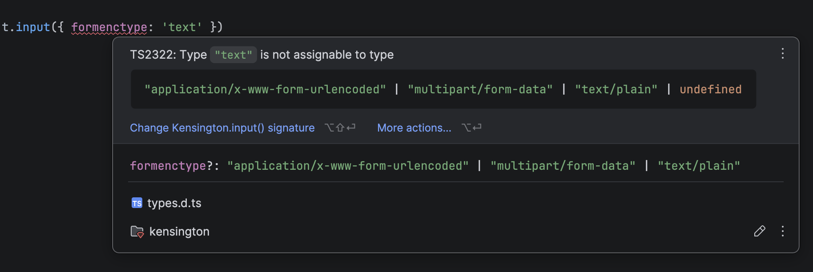

# Kensington

[](https://www.npmjs.com/package/kensington)
[](https://github.com/ryanlsimms/kensington/actions/workflows/ci.yml)
[](https://opensource.org/licenses/ISC)

HTML/SVG/MathML template library for JavaScript and TypeScript. Output can be either an HTML string, or DOM elements if run in the browser.

Attributes and their values are comprehensively typed with the official [HTML](https://html.spec.whatwg.org), [SVG](https://svgwg.org), [MathML](https://developer.mozilla.org/en-US/docs/Web/MathML) specs and will be kept up to date as the spec changes. They can also be validated at runtime with a warning or error.

The goal is to be simple to learn and let developers code in pure JavaScript or TypeScript without compiling from another file format. Debugging becomes more straightforward and components are plain functions with no special syntax to learn and remember.

**[Full documentation →](https://ryanlsimms.github.io/kensington)**

## Installation

```bash
npm install kensington
```
```javascript
import Kensington, { t } from 'kensington';
```

Or in a browser without a build step, via CDN:

```html
<script type="module">
  import Kensington from 'https://cdn.jsdelivr.net/npm/kensington/dist/kensington.min.js';
</script>
```

## TypeScript

Attribute names and values are typed against the HTML/SVG/MathML spec, so you get autocomplete and catch mistakes at compile time.



## Example

```javascript
import { t } from 'kensington';

const users = [
  { name: 'Alice', role: 'Admin',  active: true },
  { name: 'Bob',   role: 'Editor', active: true },
  { name: 'Carol', role: 'Viewer', active: false },
];

function userRow({ name, role, active }) {
  return t.tr([
    t.td(name),
    t.td(role),
    t.td([
      t.input({ type: 'checkbox', checked: active, ariaLabel: `${name} is active` }),
      active && t.span({ class: 'label' }, 'Yes'),
    ]),
  ]);
}

const page = t.htmlWithDocType({ lang: 'en' }, [
  t.head([
    t.meta({ charset: 'utf-8' }),
    t.title('Users'),
    t.link({ rel: 'stylesheet', href: '/style.css' }),
  ]),
  t.body(
    t.main({ class: ['container', 'padded'] }, [
      t.h1({ style: { color: 'steelblue' } }, 'Users'),
      t.table([
        t.thead(t.tr(['Name', 'Role', 'Active'].map(h => t.th(h)))),
        t.tbody(users.map(userRow)),
      ]),
    ])
  ),
]).toString();
```

```html
<!DOCTYPE html>
<html lang="en">
  <head>
    <meta charset="utf-8">
    <title>Users</title>
    <link rel="stylesheet" href="/style.css">
  </head>
  <body>
    <main class="container padded">
      <h1 style="color: steelblue">Users</h1>
      <table>
        <thead>
          <tr>
            <th>Name</th>
            <th>Role</th>
            <th>Active</th>
          </tr>
        </thead>
        <tbody>
          <tr>
            <td>Alice</td>
            <td>Admin</td>
            <td>
              <input type="checkbox" checked aria-label="Alice is active">
              <span class="label">Yes</span>
            </td>
          </tr>
          <tr>
            <td>Bob</td>
            <td>Editor</td>
            <td>
              <input type="checkbox" checked aria-label="Bob is active">
              <span class="label">Yes</span>
            </td>
          </tr>
          <tr>
            <td>Carol</td>
            <td>Viewer</td>
            <td>
              <input type="checkbox" aria-label="Carol is active">
            </td>
          </tr>
        </tbody>
      </table>
    </main>
  </body>
</html>
```

## Reactive Data

In the browser, import `signal`, `computed`, and `effect` to build reactive UIs. Pass a signal as content or an attribute value and the DOM updates live.

```javascript
import { t, signal, computed, effect } from 'kensington';

const count = signal(0);
const doubled = count.transform(n => n * 2);
const label = computed(() => count.get() === 1 ? 'click' : 'clicks');

effect(() => {
  document.title = `${count.get()} ${label.get()}`;
});

const app = t.div([
  t.p([count, ' ', label, ' — doubled: ', doubled]),
  t.button({ type: 'button', onclick: () => count.set(n => n + 1) }, 'Click'),
]);

document.body.append(app.toElement());
```

## TypeScript

Attribute names and values are typed against the HTML/SVG/MathML spec, so you get autocomplete and catch mistakes at compile time.


